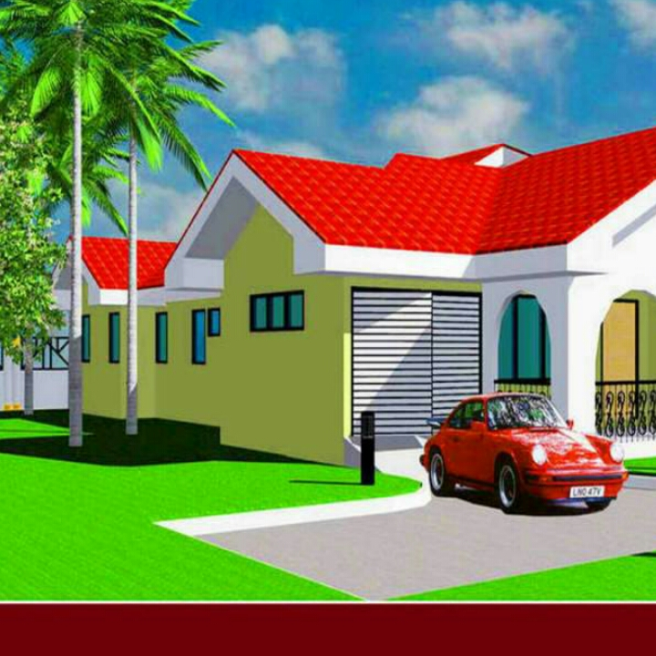

<!DocType html><head><body># gbeio.devpage.net
repository <a href="https://github.com/gbeio/gbeio.devpage.net"target="main_Page">Page</a>
<link rel="stylesheets"href="style.css">

2
0 -1 false false BEHIND 0

If we are replacing the title, force it to render anyway, and it'll be hidden in CSS.
Nav primarily intended for sections that consist of major navigation blocks.
 Home
Clear out style (needs to be a non-empty string)
Clear out style (needs to be a non-empty string)
true true 0 true true
Ripple, and show 'keep reading' as the default.
Overridden, and migrated to postFooter. Called as postFooterJumpLink. We don't display labels on the home page. We call super.postShareButtons from the migrated positions. Re-order the thumbnail before the snippet, add 'Keep reading' link.
false #2196f3 true true #212121 false #757575 TextAndImage #ffffff false 1x1 true true true 3 false #ffffff true false Cap the total number of ads (widgets and inline ads). Filter out the featured post, but only on the homepage.
<imges src="img(3).jpg">

dhalaa biyya awroopaa

Clear out style (needs to be a non-empty string) Don't show feed links.
()
Don't show

Ripple, and show 'keep reading' as the default.
Overridden, and migrated to postFooter. Called as postFooterJumpLink. We don't display labels on the home page.
We call super.postShareButtons from the migrated positions.
Don't show

3 true true LAST_YEAR Default the title to 'Popular posts from this blog'.
Ripple, and show 'keep reading' as the default.
Overridden, and migrated to postFooter. Called as postFooterJumpLink. We don't display labels on the home page. We call super.postShareButtons from the migrated positions. Add a 'keep reading' link to the item-content.
true true
No title for single profiles. Default to 'Blog authors' for team.
<video src="jireenyaa.3gp">
 <iframe src="https://google.com"width="200"height="300">
Change link to 'visit profile'
FLAT yyyy true 09/05/2015 false true MONTHLY
Details</body></head>
ALPHA LIST ALL false
Details
